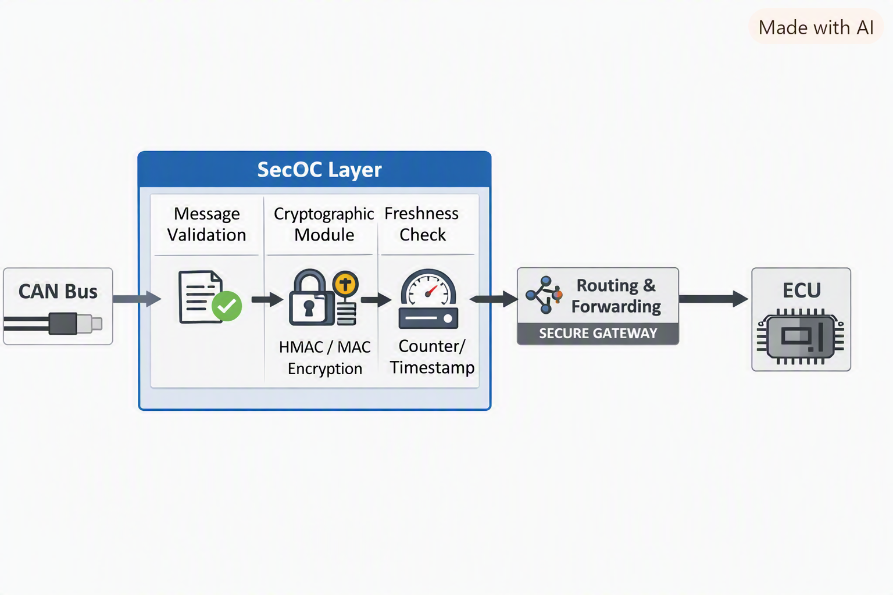

# 🚀 secure-message-gateway

⚡ Ultra‑Secure, Ultra‑Fast Message Validation & Protection  
HMAC • Freshness • Deterministic Pipeline • Full Test Suite


---

## 🌟 What This Gateway Delivers

Modern embedded systems need **trustworthy messages**.  
This gateway ensures every PDU is **authentic, fresh, validated, logged** — with zero guesswork.

Built for developers who want:

- 🔐 **Strong cryptographic integrity (HMAC‑SHA256)**
- 🕒 **Replay‑proof freshness counters**
- 📜 **Deterministic validation pipeline**
- 🧪 **Full test coverage (unit + integration + BDD)**
- ⚙️ **Clean architecture ready for extension**

It’s fast, predictable, secure — and engineered for real‑world production environments.

---

## 🔧 Architecture Snapshot

<br>
<p align="center">
  
</p>
<br>

---

## 🏗️ Core Components

- `gateway.py` — orchestrates validation → crypto → freshness → logging  
- `crypto.py` — HMAC‑SHA256 signing & verification  
- `freshness.py` — monotonic counters (anti‑replay)  
- `logger.py` — secure rotating audit logs  
- `models.py` — strict DTO validation  
- `exceptions.py` — deterministic error taxonomy  

---

## 🧪 Testing Strategy

- Unit tests for crypto, freshness, logger, gateway  
- Integration tests for full message flow  
- BDD scenarios (Given‑When‑Then)  
- Deterministic JSON test vectors  

---

## 📦 Project Structure

```bash
secure-message-gateway/
├── src/secure_gateway/
├── config/
├── tests/
├── examples/
├── scripts/
├── docs/
└── ci/
```


---

## ▶️ Getting Started
```bash
git clone https://github.com/ingDin/secure-message-gateway
cd secure-message-gateway
pip install -r requirements.txt
pytest -v
```
---
## 📌 Roadmap

- REST API interface
- Selenium monitoring dashboard 
- AES-GCM encryption layer 
- CI/CD pipeline 
- Performance & stress tests


## 📄 License
MIT
