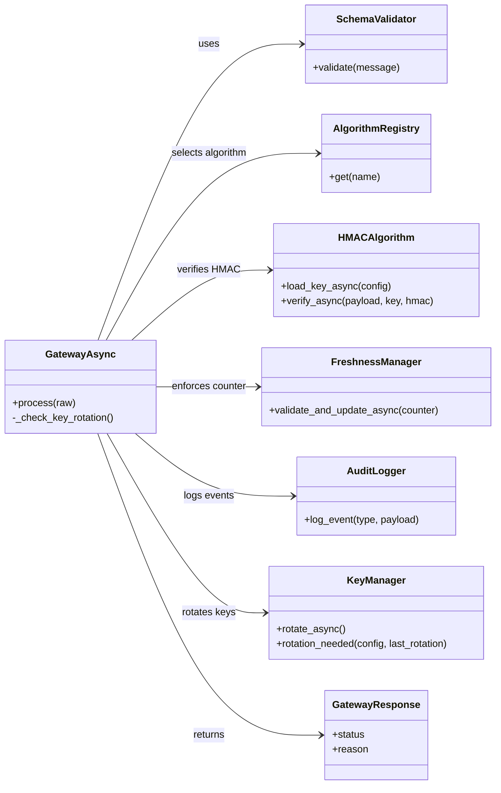

# Architecture Overview
The `secure-message-gateway` implements a deterministic, asynchronous
security pipeline designed for embedded and industrial environments.
This document describes the system-level architecture only, without
module-level details (see `components.md` for those).

---

## 1. System-Level Architecture

The gateway enforces a strict linear pipeline:

validation → crypto → freshness → audit → response

Core architectural properties:
- deterministic ordering of all operations  
- isolation between functional domains  
- reproducible behaviour across environments  
- predictable error signaling  
- async I/O for all stateful subsystems  

---

## 2. Functional Domains

The architecture is organized into five independent domains:

1. **Validation Layer**  
   Ensures structural correctness before any security operation.

2. **Cryptographic Layer**  
   Performs deterministic HMAC verification using sorted JSON payloads.

3. **Freshness Layer**  
   Enforces monotonic counters, increment rules, drift limits, and replay protection.

4. **Audit Layer**  
   Records structured JSON-lines events for observability and traceability.

5. **Orchestration Layer**  
   Coordinates all subsystems under a unified asynchronous execution model.

Each domain is isolated and communicates through stable, deterministic interfaces.

---

## 3. Architecture Diagram

## 4. Summary

The gateway architecture provides a **deterministic**, **auditable**, and **modular**
security pipeline suitable for **embedded**, **industrial**, and **safety-critical systems**.
It defines **clear functional domains**, a **fixed execution sequence**, and **strict isolation**
between components, ensuring **predictable** and **reproducible behaviour**.
