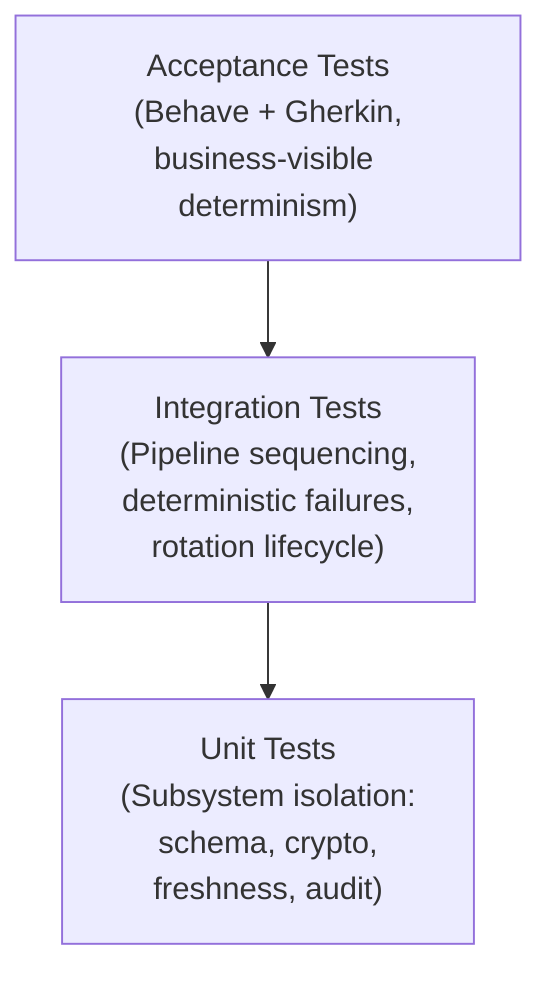

# TEST_STRATEGY.md  
The test strategy outlines the layered approach that ensures deterministic, reproducible, and fully validated gateway behavior.

---

# 1. Objectives

The testing strategy ensures that the secure-message-gateway behaves deterministically and safely under all conditions.  
Core objectives:

- Validate the full pipeline: **Schema → HMAC → Freshness → Rotation → Audit → Response**  
- Guarantee cryptographic integrity and predictable key lifecycle behavior  
- Enforce monotonic counters and replay protection  
- Ensure append-only, ordered audit logging  
- Detect defects early through layered testing (unit → integration → acceptance)  
- Provide confidence that the gateway remains reproducible, observable, and secure across environments  

---

# 2. Scope

## 2.1 In Scope
- Schema validation  
- Cryptographic verification (HMAC)  
- Key loading and rotation  
- Freshness enforcement (monotonicity, drift, replay)  
- Audit logging (append-only, ordered, deterministic)  
- Gateway orchestration logic  
- Unit, integration, and acceptance tests  
- Determinism guarantees and state persistence correctness  

## 2.2 Out of Scope
- Network transport  
- Performance benchmarking  
- Hardware security modules  
- External crypto library correctness  
- Distributed synchronization  
- Production observability tooling  

---

# 3. Methodology

## 3.1 Principles
- **Determinism first**: identical inputs → identical outputs  
- **Fail-fast pipeline**: schema blocks crypto; crypto blocks freshness; freshness blocks rotation  
- **Isolation**: each test runs in a clean filesystem sandbox  
- **Security-driven validation**: correctness > performance  
- **Layered testing**: unit → integration → acceptance  

## 3.2 Approach
- Unit tests use mocks, fakes, deterministic factories  
- Integration tests use real persistence + real crypto  
- Acceptance tests use Behave + Gherkin  
- Timestamp determinism enforced via `freezegun`  
- Audit ordering validated explicitly  
- Rotation lifecycle tested end-to-end  

---

## 4.1 Test Pyramid

A compact visual model of how tests are structured and how much weight each layer carries:

Interpretation:
- **Unit tests** form the foundation: strict, deterministic subsystem validation  
- **Integration tests** validate pipeline behavior end-to-end  
- **Acceptance tests** validate business-visible correctness and audit traceability  

---

## 4.2 Unit Testing — Subsystem Isolation

Unit tests validate each subsystem independently, ensuring deterministic behavior and strict contract enforcement.

---

### **SchemaValidator**
- Required fields, types, and constraints  
- Deterministic rejection of malformed messages  

---

### **Cryptographic Layer**
- **AlgorithmRegistry:** resolves and validates supported algorithms  
- **HMACAlgorithm:** deterministic signing/verification, invalid key handling  
- **KeyFileStore:** JSON parsing, serialization, corruption handling  
- **KeyManager:** rotation interval logic, atomic rotation, archival, audit logging  

---

### **FreshnessManager**
- Replay detection  
- Increment bounds enforcement  
- Drift violation detection  
- Deterministic persistence of freshness state  

---

### **AuditLogger**
- JSON-lines serialization  
- Strict append-only behavior  
- Deterministic error propagation

**Guarantees:** deterministic behavior, strict error signaling, no shared state.

---

## 4.3 Integration Testing — Full Pipeline Validation

Integration tests validate the complete gateway pipeline end‑to‑end, ensuring correct stage sequencing, deterministic failure behavior, and stable audit ordering across all processing paths.

### **SCHEMA_FAIL**
- **Cause:** Malformed or structurally invalid messages  
- **Behavior:** Pipeline stops immediately  
- **Audit:** Exactly one event → `SCHEMA_FAIL`

---

### **HMAC_FAIL**
- **Cause:** Invalid MAC or corrupted key files  
- **Behavior:** Deterministic crypto failure  
- **Pipeline:** No freshness checks, no rotation  
- **Audit:** Exactly one event → `HMAC_FAIL`

---

### **FRESHNESS_FAIL**
- **Cause:** Replay, abnormal increment, or drift violation  
- **Behavior:** Deterministic halt at freshness stage  
- **Audit:** Final event → `FRESHNESS_FAIL`

---

### **Deterministic Response**
- Identical messages produce **identical `GatewayResponse` objects**  
- Audit ordering remains **stable and reproducible**

---

### **Key Rotation Lifecycle**
- Outdated key triggers rotation  
- Expected sequence:  
  **`ROTATION → HMAC_FAIL → MESSAGE_ACCEPTED`**  
- Rotation is **atomic**, **archived**, and **logged first**

**Guarantees:** correct sequencing, reproducible failures, stable audit ordering.

---

## 4.4 Acceptance Testing — Business-Level Behavior

Validates observable behavior using Behave + Gherkin:

### Scenarios
- Valid message → `ok`  
- Invalid schema → `SCHEMA_FAIL`  
- Invalid HMAC → `HMAC_FAIL`  
- Replay → `FRESHNESS_FAIL`  
- Rotation lifecycle → `ROTATION → HMAC_FAIL → MESSAGE_ACCEPTED`  

### Environment
Each scenario runs in a fully isolated `tmp_behave/` directory with fresh persistence files and a deterministic configuration.

**Guarantees:** business-visible determinism, strict pipeline semantics, predictable rotation behavior.

---

# 5. Summary

This compact testing strategy defines a complete, deterministic validation framework for the secure-message-gateway:

- **Unit tests** ensure subsystem correctness and strict contract enforcement  
- **Integration tests** validate pipeline sequencing, deterministic failures, and rotation lifecycle  
- **Acceptance tests** confirm business-visible behavior and audit traceability  
- The **test pyramid** clarifies the weight and purpose of each layer  

Together, these layers guarantee that the gateway behaves **safely, predictably, and reproducibly** under all operating conditions, fulfilling its role in **security-critical and audit-driven deployments**.
