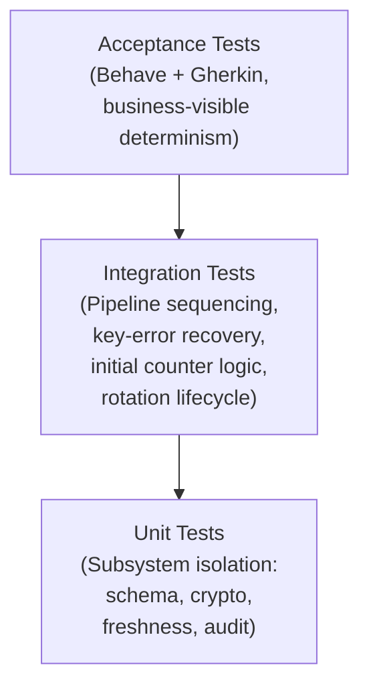

# TEST_STRATEGY.md  
Deterministic, reproducible, and security‑driven validation strategy for the secure-message-gateway.

---

# 1. Objectives

The testing strategy ensures that the secure-message-gateway behaves deterministically and safely under all conditions.

Core objectives:

- Validate the full pipeline: **Schema → HMAC → Freshness → Rotation → Audit → Response**
- Guarantee cryptographic integrity and predictable key lifecycle behaviour
- Enforce monotonic counters, replay protection, and correct initial counter bootstrapping
- Ensure append-only, ordered audit logging
- Validate deterministic recovery from corrupted key material (**KeyError → rotation → HMAC_FAIL → acceptance**)
- Detect defects early through layered testing (unit → integration → acceptance)
- Provide confidence that the gateway remains reproducible, observable, and secure across environments

---

# 2. Scope

## 2.1 In Scope
- Schema validation  
- Cryptographic verification (HMAC)  
- Key loading, corruption handling, and rotation lifecycle  
- Freshness enforcement:
  - monotonicity  
  - drift  
  - increment bounds  
  - replay  
  - **initial counter resolution**:
    - from config (`initial_counter: N`)
    - from file (`freshness.json`)
    - automatic (`initial_counter: auto`)
- Audit logging (append-only, ordered, deterministic)
- Gateway orchestration logic
- Unit, integration, and acceptance tests
- Determinism guarantees and state persistence correctness

## 2.2 Out of Scope
- Network transport  
- Performance benchmarking  
- Hardware security modules  
- External crypto library correctness  
- Distributed synchronization  
- Production observability tooling  

---

# 3. Methodology

## 3.1 Principles
- **Determinism first**: identical inputs → identical outputs  
- **Fail-fast pipeline**: schema blocks crypto; crypto blocks freshness; freshness blocks rotation  
- **Isolation**: each test runs in a clean filesystem sandbox  
- **Security-driven validation**: correctness > performance  
- **Layered testing**: unit → integration → acceptance  
- **Predictable recovery**: corrupted key material must trigger deterministic KeyError → rotation → HMAC_FAIL → acceptance with new key  

## 3.2 Approach
- Unit tests use mocks, fakes, deterministic factories  
- Integration tests use real persistence + real crypto  
- Acceptance tests use Behave + Gherkin  
- Timestamp determinism enforced via `freezegun`  
- Audit ordering validated explicitly  
- Rotation lifecycle tested end-to-end  
- **Freshness initial counter logic validated across all branches**

---

# 4. Test Pyramid

## 4.2 Unit Testing — Subsystem Isolation

### **SchemaValidator**
- Required fields, types, constraints  
- AdditionalProperties enforcement  

### **Cryptographic Layer**
- AlgorithmRegistry resolution  
- HMACAlgorithm deterministic signing/verification  
- KeyFileStore corruption handling  
- KeyManager rotation interval logic, archival, atomic updates  

### **FreshnessManager**
- Replay detection  
- Increment bounds  
- Drift violation  
- **Initial counter resolution:**
  - config value (`initial_counter: N`)
  - file value (`freshness.json`)
  - auto mode (`initial_counter: auto`)
- Respecting `reset_on_start`

### **AuditLogger**
- JSON-lines serialization  
- Append-only semantics  
- Deterministic timestamp behaviour  

---

## 4.3 Integration Testing — Full Pipeline Validation

Integration tests validate the complete gateway pipeline end‑to‑end.

### **SCHEMA_FAIL**
Malformed messages → immediate halt → audit: `SCHEMA_FAIL`

### **HMAC_FAIL**
Invalid MAC or corrupted key → crypto halt → audit: `HMAC_FAIL`

### **FRESHNESS_FAIL**
Replay, abnormal increment, drift violation → audit: `FRESHNESS_FAIL`

### **Deterministic Response**
Identical messages → identical `GatewayResponse`  
Audit ordering stable and reproducible  

---

### **Key Rotation Lifecycle**
Outdated key triggers rotation  
Expected sequence:  
**`ROTATION → HMAC_FAIL → MESSAGE_ACCEPTED`**  
Rotation is atomic, archived, and logged first.

---

### **KeyError Recovery (NEW)**
Corrupted key file triggers deterministic recovery:

1. First valid message → accepted  
2. Corruption introduced in `keys.json`  
3. Next message → KeyError → rotation  
4. Message signed with old key → `HMAC_FAIL`  
5. Message signed with new key → `MESSAGE_ACCEPTED`

Guarantees: predictable recovery, safe rejection of stale signatures, acceptance of new key material.

---

### **Freshness Initial Counter Logic (NEW)**

Integration tests validate all branches:

- `initial_counter: auto` → load from file  
- `initial_counter: N` → override file  
- `reset_on_start: false` → preserve stored counter  
- First message never enforces freshness  
- Second and third messages enforce monotonic progression  

---

## 4.4 Acceptance Testing — Business-Level behaviour

Behave + Gherkin validate observable behaviour:

### **Scenarios**
- Valid message → `ok`  
- Invalid schema → `SCHEMA_FAIL`  
- Invalid HMAC → `HMAC_FAIL`  
- Replay → `FRESHNESS_FAIL`  
- Rotation lifecycle → `ROTATION → HMAC_FAIL → MESSAGE_ACCEPTED`  
- KeyError recovery → deterministic rotation + acceptance  
- Initial counter from storage → replay detection  

### **Environment**
Each scenario runs in a fully isolated `tmp_behave/` directory with fresh persistence files and deterministic configuration.

---

## 5. Summary

This updated testing strategy defines a complete, deterministic validation framework for the secure-message-gateway:

- **Unit tests** ensure subsystem correctness, strict contracts, and initial counter logic  
- **Integration tests** validate pipeline sequencing, deterministic failures, rotation lifecycle, and key-error recovery  
- **Acceptance tests** confirm business-visible behaviour, audit traceability, and correct initial counter bootstrapping  

Together, these layers guarantee that the gateway behaves **safely, predictably, and reproducibly** under all operating conditions, including corrupted key material and dynamic freshness initialization.
